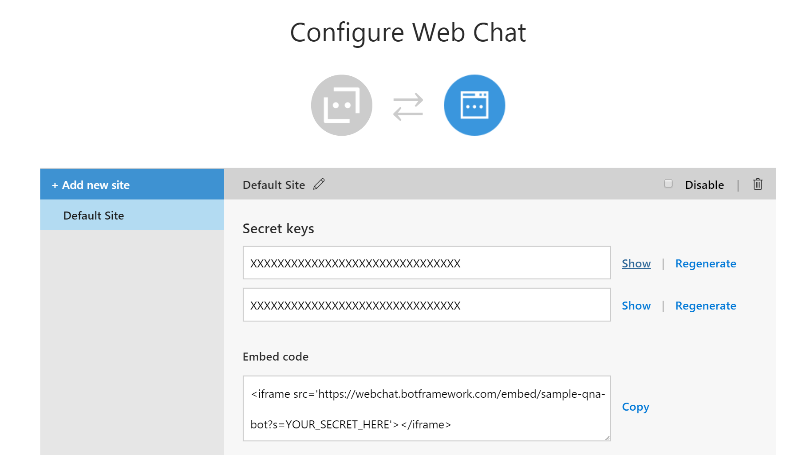

# Creating an enhanced Q&A Bot

[QnA Maker](https://qnamaker.ai) is a great tool for quickly standing up a knowledge base.  It has the ability to scan existing FAQs, upload XLSX files containing Question & Answer pairs, or just manually editing Q&A pairs.  Once configured, it's trivial to set up and publish your first chat bot in a matter of minutes.

However, this approach doesn't allow for using some of the cool features that Bot Framework supports, including Rich Cards, Adaptive Cards, Conversation History Logging, or Proactive messaging (e.g. pinging the user when they've been idle for a bit to see if they're still engaged).  This tutorial will show how to set up your initial bot from a Q&A knowledge base, and add in some of these features.

## Step 1: Creating your Bot in Azure

1. Browse to [https://portal.azure.com](https://portal.azure.com)
2. Click the `+ Create Resource` button, then search for `Web App Bot`
3. Choose `Web App Bot` from the search results, and then click the 'Create' button
4. Enter in a unique `Bot name`
5. Choose the `Subscription` you want to host this bot in
6. Enter a name for your new `Resource Group`, or choose an existing one
7. Select your `Location` for your bot to be hosted
8. Choose a `Pricing Tier`
9. Click on the `Bot template` setting, and choose the `Question and Answer` tile, then click the `Select` button
10. Select an App Service Plan (choose either and existing one, or create a new one)
11. Leave the defaults for `Azure Storage` and `Application Insights` (you can turn these off if you want, but generally you want them both on)
12. Click `Create` to create your new bot

## Step 2: Connect your bot to your QnA Knowledge Base

Now that you've created your new bot, you need to update the configuration to point to your QnA Knowledge Base

1. In the Azure Portal, click on `Resource Groups`, and choose the resource group that you created in Step 1 above.
2. Find the `Web App Bot`, click on it
3. Test the bot by clicking on the `Test in Web Chat` page under `Bot Management`
4. Enter anything into the input field, and submit.  Confirm that the response back is something like `Please set QnAKnowledgebaseId and QnASubscriptionKey in App Settings. Get them at https://qnamaker.ai.`
5. Choose the `Application Settings` page under `App Service Settings`, then scroll down until you find the `QnAKnowledgebaseId` and `QnASubscriptionKey` fields under `App Settings`


6. Open a new tab, and browse to [https://qnamaker.ai](https://qnamaker.ai)
7. Click on `My Services`, then click the Edit (i.e. pencil) icon to choose your QnA knowledge base
8. Click "Settings", and then scroll down until you find the section marked `Deployment details`.  In it, you'll see something like this:

9. On the first line (starting with POST), copy the GUID from the sample URL (e.g. copy **d4c9b8de-d4c0-4c5f-8fad-f73eade09340** from `/knowledgebases/d4c9b8de-d4c0-4c5f-8fad-f73eade09340/generateAnswer`
10. Return to the Azure, and paste the GUID copied in the previous step into the `QnAKnowledgebaseId` field
11. Return to the QnA Maker settings, and locate the line beginning with `Ocp-Apim-Subscription-Key`, and copy the Subscription key (e.g. **19af6e2d4cfa4c2ab28f337d05d7730e** from `Ocp-Apim-Subscription-Key: 19af6e2d4cfa4c2ab28f337d05d7730e`)
12. Return to the Azure Portal, and past the Subscription Key into the `QnASubscriptionKey` field
13. Click the `Save` button at the top of the `Application Settings` blade

You've now configured your bot to be able to retrieve answers from your QnA Knowledge Base.  You can test your bot by returning to the `Test in Web Chat` blade, and sending another message.  You should now return an answer that has been pulled from your QnA Maker Knowledge Base.

## Step 3: Create a local WebChat.html page

Now that your bot is configured you can embed it in your website.  We're not going to cover everything involved in actually embedding the chat in your site, but for testing purposes, we will create a quick HTML page that you can use locally to test the bot

1. Anywhere on your local machine, create a new empty text file called `WebChat.html`, then past in the following code:

```<html>
<head>
<style type="text/css">
body {
   margin: 0;
   overflow: hidden;
}
#iframe1 {
    position:absolute;
    left: 0px;
    width: 100%;
    top: 0px;
    height: 100%;
}
</style>
</head> 
<body> 
<iframe id="iframe1" frameborder="0" src='https://webchat.botframework.com/embed/pot-bot-deploy?s=YOUR_SECRET_HERE'></iframe>
</body> 
</html>
```

2. Browse to your bot app, in the Azure Portal, and choose the `Channels` blade
3. Find `Web Chat` under the `Connect to Channels` section, and click the `Edit` link
4. Under the `Configure Web Chat` section, find `Secret keys`, then click on `Show` next to either of your secret keys.  Copy the value from the field.

 

5. Return to your `WebChat.html` file, and replace `YOUR_SECRET_HERE` with the secret key you copied in the previous step.
6. Open `WebChat.html` in the browser of your choice, and verify that you send a message, you get the expected response back from the bot.

If at this point, you're not getting expected responses back, you may have missed a step along the way.  This is super common (there's a lot of detailed steps here).  Just walk back through the steps carefully and make sure you've followed them exactly.

Note: The Bot Framework provides a high quality chat client that you can deploy to your website with no additional coding needed.  However, some requirements might dictate that custom styles are applied to your bot.  Fortunately, this Web Chat client is open source, and can be customized to your bots requirements.  The source code for the web chat client can be found  [here](https://github.com/Microsoft/BotFramework-WebChat), and and article showing how to update this client can be found [here](https://blog.botframework.com/2017/10/11/customize-web-chat-websites/)

## Step 4: The fun stuff (aka Adding rich card  responses to your app)

Now that we've got all the plumbing in place, we're going to add some code to our app to return rich responses to the user.  We'll focus specifically on `VideoCard` and `AdaptiveCard`, but you can easily extend the code to use any type of [Rich Card]().

1. Browse to the `Build` page on your bot
2. Click the `Download zip file` to download the source code for your project.
3. Open the project in VS 2017 (you should have the latest stable release installed)
4. Update all of your Nuget packages to the latest
5. Add in the following Nuget Packages
- Microsoft.Bot.Builder.CognitiveServices
- Microsoft.AdaptiveCards
6. Right click on your bot project, and add in a file called Utils.cs, and paste in the following code (make sure to update your namespace so the rest of your app can find the code)

```using System;
using System.Collections.Generic;
using System.Configuration;
using System.Linq;
using System.Web;

namespace YOUR_NAMESPACE_HERE
{
    public class Utils
    {
        public static string GetAppSetting(string key)
        {
#if DEBUG
            return ConfigurationManager.AppSettings[key];
#else
            return Microsoft.Bot.Builder.Azure.Utils.GetAppSetting(key);
#endif
        }
    }
}
```

This code will help you when you're debugging your bot locally, vs running it in Azure.  For local testing, you'll compile in `Debug`, and the code will read config settings from your `web.config` file.  When you deploy to Azure, you'll switch to `Release` so you the code will instead read from `App Settings`.

7. Create a new file called `ConversationLogger.cs`, and paste in the following code:

```using AdaptiveCards;
using System;
using System.Collections.Generic;
using System.Linq;
using System.Threading.Tasks;
using System.Web;
using Microsoft.Bot.Builder.History;
using Microsoft.Bot.Connector;
using System.Configuration;
using System.Data.SqlClient;
using System.Diagnostics;

namespace QnABot
{
    public class ConversationLogger : IActivityLogger
    {
        public async Task LogAsync(IActivity activity)
        {
            try
            { 
                var conversationId = activity.Conversation.Id;
                var senderId = activity.From.Id;
                var recipientId = activity.Recipient.Id;
                var message = activity.AsMessageActivity();
                var messageText = message.Text;

                //If the response is a Rich/Adaptive card, then grab the appropriate attachment(s) text as well
                if (message.Attachments.Count > 0)
                {
                    //Grab the response from the message attachments
                    foreach (Attachment a in message.Attachments)
                    {
                        switch (a.ContentType)
                        {
                            case "application/vnd.microsoft.card.video":
                                messageText += (a.Content as VideoCard)?.Text;
                                break;
                            case "application/vnd.microsoft.card.adaptive":
                                //If you have important information to capture in that's actually inside the Adaptive card, insert logic here to parse that out of each TextBlock.
                            
                                //messageText += (a.Content as AdaptiveCard)?.FallbackText;

                                //var adaptiveCard = a.Content as AdaptiveCard;
                                //foreach (CardElement item in adaptiveCard.Body)
                                //{
                                //    if(item.GetType().Name == "TextBlock")
                                //    {
                                //        messageText += (item as TextBlock).Text;
                                //    }
                                //}

                                break;
                            default:
                                break;
                        }
                    }
                }

                var timeStamp = DateTime.Now;

                //ToDo: Make this read from Utils.GetSetting so it can be configured in Azure Portal
                var connString = ConfigurationManager.ConnectionStrings["ChatHistory"].ConnectionString;

                using (var conn = new SqlConnection(connString))
                {
                    var cmd = new SqlCommand("INSERT INTO ConversationHistory(conversationId, senderId, recipientId, messageText, timeStamp) VALUES (@conversationId, @senderId, @recipientId, @messageText, @timeStamp)", conn);

                    cmd.Parameters.AddWithValue("@conversationId", conversationId);
                    cmd.Parameters.AddWithValue("@senderId", senderId);
                    cmd.Parameters.AddWithValue("@recipientId", recipientId);
                    cmd.Parameters.Add(new SqlParameter()
                    {
                        ParameterName = "@messageText",
                        Value = messageText,
                        SqlDbType = System.Data.SqlDbType.Text
                    });
                    cmd.Parameters.AddWithValue("@timeStamp", timeStamp);

                    conn.Open();
                    cmd.ExecuteNonQuery();
                }
            } catch (Exception ex) {
                Debug.WriteLine(ex.ToString());
            }
    
            Debug.WriteLine($"From:{activity.From.Id} - To:{activity.Recipient.Id} - Message:{activity.AsMessageActivity()?.Text}");
        }
    }
}
```

8. Open up your `WebApiConfig.cs` class file, and add the following line inside your `Application_Start()` method

```builder.RegisterType<ConversationLogger>().AsImplementedInterfaces().InstancePerDependency();```

When finished, you code should look like this:

```    protected void Application_Start()
        {

            // Bot Storage: This is a great spot to register the private state storage for your bot. 
            // We provide adapters for Azure Table, CosmosDb, SQL Azure, or you can implement your own!
            // For samples and documentation, see: https://github.com/Microsoft/BotBuilder-Azure

            Conversation.UpdateContainer(
                builder =>
                {
                    //Inject the ConversationLogger object
                    builder.RegisterType<ConversationLogger>().AsImplementedInterfaces().InstancePerDependency();

                    builder.RegisterModule(new AzureModule(Assembly.GetExecutingAssembly()));

                    // Using Azure Table Storage
                    var store = new TableBotDataStore(ConfigurationManager.AppSettings["AzureWebJobsStorage"]); // requires Microsoft.BotBuilder.Azure Nuget package 

                    // To use CosmosDb or InMemory storage instead of the default table storage, uncomment the corresponding line below
                    // var store = new DocumentDbBotDataStore("cosmos db uri", "cosmos db key"); // requires Microsoft.BotBuilder.Azure Nuget package 
                    // var store = new InMemoryDataStore(); // volatile in-memory store

                    builder.Register(c => store)
                        .Keyed<IBotDataStore<BotData>>(AzureModule.Key_DataStore)
                        .AsSelf()
                        .SingleInstance();
                    
                });
            GlobalConfiguration.Configure(WebApiConfig.Register);
        }
    }
```

Note: there are several different ways to log conversations with Bot Framework.  This was specifically designed to make it easy to grab a flat files with all of the conversation history in it.

9. Open up your `Dialogs\BasicQnAMakerDialog.cs`, and make sure the replace the `RespondFromQnAMakerResultAsync` method with this:

```protected override async Task RespondFromQnAMakerResultAsync(IDialogContext context, IMessageActivity message, QnAMakerResults result)
        {
            // Add code to format QnAMakerResults 'result' 

            // answer is a string
            var answer = result.Answers.First().Answer;

            Activity reply = ((Activity)context.Activity).CreateReply();

            reply.Text = answer;

            try
            {
                string[] qnaAnswerData = answer.Split(';');

                string[] supportedCardTypes = new string[] { "videocard" };

                //If the string came back as ; separated, and the first item in the array is one of the supported rich card types
                if (qnaAnswerData.Length > 1 && supportedCardTypes.Contains(qnaAnswerData[0].ToLower()))
                {
                    string cardType = qnaAnswerData[0];
                    string title = qnaAnswerData[1];
                    string description = qnaAnswerData[2];
                    string videoUrl = qnaAnswerData[3];
                    string learnMoreUrl = qnaAnswerData[4];
                    string thumbnailUrl = qnaAnswerData[5];

                    switch (cardType)
                    {
                        case "VideoCard":
                            VideoCard videoCard = new VideoCard()
                            {
                                Title = title,
                                Text = description,
                                Image = new ThumbnailUrl(thumbnailUrl)
                            };

                            videoCard.Buttons = new List<CardAction>
                            {
                                new CardAction(ActionTypes.OpenUrl, "Learn More", value: learnMoreUrl)
                            };

                            videoCard.Media = new List<MediaUrl>
                            {
                                new MediaUrl(videoUrl)
                            };

                            reply.Attachments.Add(videoCard.ToAttachment());

                            //Clear out the text, no longer needed since Video Card replied
                            reply.Text = string.Empty;

                            break;
                    }
                }
                else
                {
                    AdaptiveCard card = new AdaptiveCard();

                    //Set the fallback text in case someone sends a request from a client that doesn't yet support Adaptive Cards fully
                    //card.FallbackText = answer;

                    // Add text to the card.
                    //card.Body.Add(new TextBlock()
                    //{
                    //    Text = answer,
                    //    Wrap = true,

                    //});

                    // Add text to the card.
                    card.Body.Add(new TextBlock()
                    {
                        Text = "Was this answer helpful?",
                        Size = TextSize.Small
                    });

                    // Add buttons to the card.
                    card.Actions.Add(new SubmitAction()
                    {
                        Title = "Yes",
                        Data = "Yes, this was helpful"
                    });

                    card.Actions.Add(new SubmitAction()
                    {
                        Title = "No",
                        Data = "No, this was not helpful"
                    });

                    // Create the attachment.
                    Attachment attachment = new Attachment()
                    {
                        ContentType = AdaptiveCard.ContentType,
                        Content = card
                    };

                    reply.Attachments.Add(attachment);
                }
            }
            catch (Exception ex)
            {
                reply.Text = ex.ToString();
            }

            await context.PostAsync(reply);
            context.Wait(this.MessageReceivedAsync);
        }
```

Note: If this method isn't there, add it inside the `BasicQnAMakerDialog` class.

Make sure that you bot compiles and runs locally.  Fix any namespaces, or using statements.

## Step 5: Create the database to log your conversation history to

In this tutorial, we won't cover setting up a database in Azure.  This will assume you already have an Azure SQL database configured, and have the connection string available

1. Open up Sql Server Management Studio, and connect to your Azure SQL instance
2. Browse to your database, and click `New query`
3. Paste the following create script into the query, and run, making sure your database is selected.

```/****** Object:  Table [dbo].[ConversationHistory]    Script Date: 12/22/2017 3:01:47 PM ******/
SET ANSI_NULLS ON
GO

SET QUOTED_IDENTIFIER ON
GO

CREATE TABLE [dbo].[ConversationHistory](
	[conversationId] [nchar](255) NOT NULL,
	[senderId] [nchar](255) NOT NULL,
	[recipientId] [nchar](255) NOT NULL,
	[messageText] [text] NOT NULL,
	[timeStamp] [datetime] NOT NULL
) ON [PRIMARY] TEXTIMAGE_ON [PRIMARY]
GO

```

4. Open up the web.config in your project, and add in a section for your connection strings, just under the `</appSettings>` node

```
  <connectionStrings>
    <add name="ChatHistory" connectionString="YOUR_CONNECTION_STRING_HERE" />
  </connectionStrings>
```

The code is already written to pull from this connection string, so you don't need to make any further changes here.

## Step 6: Publish your enhanced bot in Azure

1. In Visual Studio, right click on your project in the Solution Explorer, and click `Publish...`
2. The Publish Profile for your app was included in the source code, so all you should need to do is click the `Publish` button
3. Refresh your `WebChat.html` page in the browser, and confirm that you now see rich cards coming back in your response.


## Step 7: Bonus - Add a VideoCard into your QnA maker

One of the things that is in the code is the ability to format your QnA pair in QnA maker in a way that your bot app can interpret it as a Video Card.  How you format your QnA pairs to do this is up to you, but this shows one example.

1. Return to your QnA Knowledge Base in [https://qnamaker.ai](https://qnamaker.ai)
2. In your Knowledge Base, click on the `Add QnA Pair` button, and place the following:

Question: `Please show me the video`
Answer: `VideoCard;Big Buck Bunny;Big Buck Bunny (code-named Peach) is a short computer-animated comedy film by the Blender Institute, part of the Blender Foundation. Like the foundation\'s previous film Elephants Dream, the film was made using Blender, a free software application for animation made by the same foundation. It was released as an open-source film under Creative Commons License Attribution 3.0.;http://download.blender.org/peach/bigbuckbunny_movies/BigBuckBunny_320x180.mp4;https://peach.blender.org/;https://upload.wikimedia.org/wikipedia/commons/thumb/c/c5/Big_buck_bunny_poster_big.jpg/220px-Big_buck_bunny_poster_big.jpg`

This string contains 6 parts:

- A directive (i.e. `VideoCard`) of what type of Rich Card to show
- The title of the video
- A Description of the video
- The URL for the video
- The URL for a "Learn More" URL
- The URL for a thumbnail

The code in BasicQnAMakerDialog will look for this `VideoCard` prefix, and pull out the necessary values.

```                    
string cardType = qnaAnswerData[0];
string title = qnaAnswerData[1];
string description = qnaAnswerData[2];
string videoUrl = qnaAnswerData[3];
string learnMoreUrl = qnaAnswerData[4];
string thumbnailUrl = qnaAnswerData[5];
```

Once these values are put into an array, the code will determine that the intent was to display a Video Card instead of an Adaptive Card, and present that back to the user.

# Conclusion

Congratulations!  You've gut the beginnings of an enhanced chat bot that uses a QnAMaker knowledge based as the source for it's responses.  There is still quite a lot you can do with your bot.  I recommend reading through the Bot Framework documentation [here](https://docs.microsoft.com/en-us/bot-framework/) to learn more about what other features you can add to your bot.